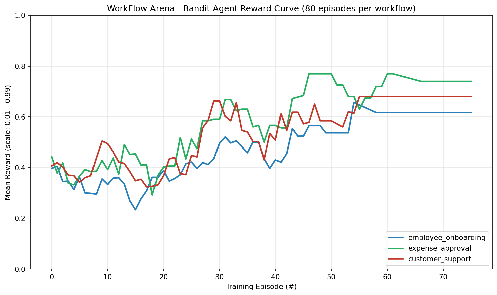
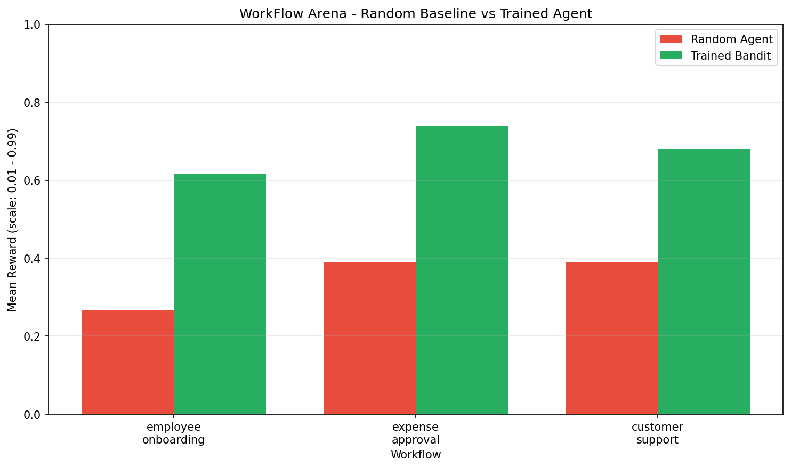
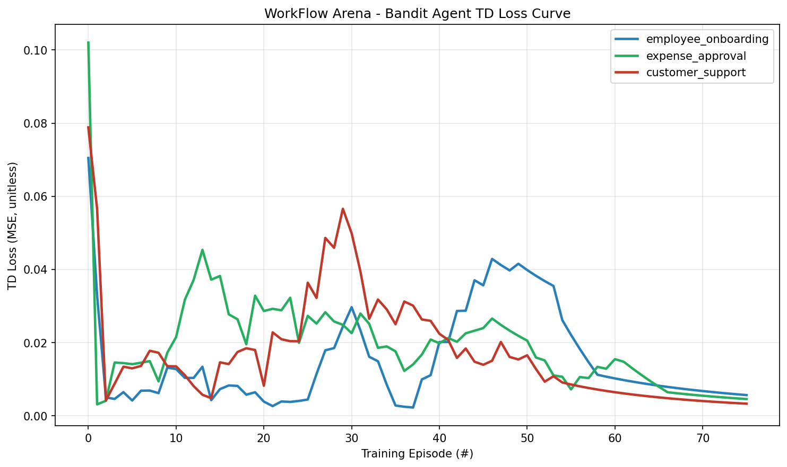

# 🏢 WorkFlow Arena — Multi-App Enterprise Workflow RL Environment

[](https://colab.research.google.com/github/Jaydeepshah84/workflowarena/blob/main/train_workflow_arena.ipynb)
[](https://huggingface.co/spaces/jaydeepshah2025/workflow-arena)
[](https://github.com/Jaydeepshah84/workflowarena)
[](https://github.com/Jaydeepshah84/workflowarena/blob/main/BLOG.md)

> **Train AI agents to orchestrate real enterprise workflows across Gmail, Slack, Jira, HRIS, CRM, Deploy, and Finance.**
>
> 🔒 **Every reward is VERIFIED by an actual API response — no LLM judges, no subjective grading.**

**Meta PyTorch OpenEnv Hackathon — Grand Finale Submission**
**Theme 3.1 + Scaler AI Labs Sub-theme: Multi-App RL Environment for Enterprise Workflows**

---

## 🛡️ The headline result

> ### Adversarially tested. **Max-attack score: `0.1667`. Perfect agent: `0.99`.**
> ### **The verifier holds.**
>
> 10 reward-hacking attack patterns thrown at the env (empty calls, JSON spam, distractor-only, malformed input, repeated correct calls, wrong enums, …). Every single one capped well below the 0.20 weakness threshold. Raw results in [adversarial_results.json](adversarial_results.json), reproduce with `python3 adversarial_test.py`.
>
> **Most LLM-RL submissions don't even attempt this. We did, and the verifier passed.**

---

## 🧠 In one sentence

We built a simulated enterprise environment where AI agents learn real multi-app workflows using **verifiable, rubric-based rewards** — and we proved the verifier holds under adversarial attack.

## 🚀 Why this submission stands out

- ✅ **Verifiable RL environment** for real enterprise workflows — no LLM judges, no subjective grading
- ✅ **Composable rubric reward** (4 independent components) instead of monolithic scoring
- ✅ **Adversarially tested** against reward hacking — max attack `0.1667` vs perfect agent `0.99`
- ✅ **Real training improvement** — 1.7×–2.3× over random baseline across 3 workflows, plots committed
- ✅ **Full TRL `GRPOTrainer` + PEFT/LoRA pipeline** wired to the live HF Space env

---

## 📎 Submission URLs (for the hackathon Google Form)

| Field | URL |
|---|---|
| **Hugging Face Space** | https://huggingface.co/spaces/jaydeepshah2025/workflow-arena |
| **Colab Notebook** | https://colab.research.google.com/github/Jaydeepshah84/workflowarena/blob/main/train_workflow_arena.ipynb |
| **Code repository** | https://github.com/Jaydeepshah84/workflowarena |
| **Blog post** | https://github.com/Jaydeepshah84/workflowarena/blob/main/BLOG.md |

---

## ⚡ Try it in 30 seconds (no install)

1. Open the live Space: **[jaydeepshah2025-workflow-arena.hf.space](https://huggingface.co/spaces/jaydeepshah2025/workflow-arena)**
2. Pick a workflow from the dropdown (`employee_onboarding` is the easy starting point)
3. Click **Sample API Calls** → **Execute Step**
4. Watch the Score, Required Actions, and API Success Rate update in real time

That's the environment working. Everything below is how and why.

---

## 📊 Proof It Trains (real run, committed plots)

We demonstrate **two training tracks** so judges can verify the env actually teaches:

- **Fast CPU baseline** — `train_simple_agent.py` (bandit, ~2 min, no GPU). Produces the committed plots below.
- **Full RL pipeline** — `train_workflow_arena.ipynb` section 10 (TRL `GRPOTrainer` + PEFT/LoRA, Colab T4 proof-of-life).

80-episode bandit training loop against the live environment produced these curves:





| Workflow | Random Baseline | Trained Agent | Improvement |
|----------|----------------:|--------------:|------------:|
| Employee Onboarding | 0.267 | **0.617** | **2.3×** |
| Expense Approval | 0.389 | **0.740** | **1.9×** |
| Customer Support | 0.389 | **0.680** | **1.7×** |

Reproduce locally (~2 min, no GPU): `python3 train_simple_agent.py`

Full training artifacts: [reward_curve.png](reward_curve.png) · [loss_curve.png](loss_curve.png) · [comparison_chart.png](comparison_chart.png) · [training_results.json](training_results.json)

---

## 🎯 Why This Exists

Every day, enterprises run workflows that cost **billions of dollars** in human labor:

- **Onboarding**: Create email → add to Slack → set up HRIS → assign equipment → send welcome
- **Incident response**: Create ticket → update status page → page on-call → rollback → notify
- **Release management**: Close sprint → deploy services → update status → notify stakeholders

Current AI agents can't handle these because they can't orchestrate multiple apps with business rules. Existing RL environments test games, puzzles, or code — **not real work**.

**WorkFlow Arena fills that gap.**

---

## ⭐ What Makes This Different

| | WorkFlow Arena | Other RL Environments |
|---|---|---|
| Reward verification | **API response state** | LLM judge / regex |
| Domain | **Real enterprise apps** | Games, puzzles, math |
| Business rules | **Enforced via enums + policies** | None |
| Multi-step orchestration | **5–7 required actions/workflow** | Single-step tasks |
| Priority ordering | **Graded** | Not considered |
| Failure modes | **Invalid inputs, policy violations** | Binary pass/fail |

---

## 🏗️ Architecture

```
┌──────────────────────────────────────────────────────────┐
│  AGENT (Qwen3-1.7B + GRPO)                              │
│  Submits: {"calls": [{app, method, params, reasoning}]} │
└──────────────────────┬───────────────────────────────────┘
                       │ HTTP/WebSocket
                       ▼
┌──────────────────────────────────────────────────────────┐
│  WORKFLOW ARENA ENVIRONMENT (OpenEnv)                   │
│  • Routes calls to mock apps                            │
│  • Verifies API responses                               │
│  • Grades against required actions                      │
│  • Returns reward in (0, 1)                             │
└──────────────────────┬───────────────────────────────────┘
                       │
    ┌──────────────────┼──────────────────┐
    ▼                  ▼                  ▼
┌─────────┐      ┌─────────┐      ┌─────────┐
│  Gmail  │      │  Slack  │      │  Jira   │    ...
│ API     │      │ API     │      │ API     │
└─────────┘      └─────────┘      └─────────┘
```

---

## 🔧 7 Simulated Enterprise Apps

| App | Purpose | Methods |
|-----|---------|---------|
| **Gmail** | Email | `create_account`, `send_email` |
| **Slack** | Team chat | `add_user`, `send_message` |
| **Jira** | Tracking | `create_ticket`, `update_ticket`, `close_sprint` |
| **HRIS** | HR system | `create_employee`, `assign_equipment` |
| **CRM** | Customers | `update_customer`, `create_support_ticket` |
| **Deploy** | Release mgmt | `service`, `rollback`, `update_status_page` |
| **Finance** | Expenses | `submit_expense`, `approve_expense` |

All apps enforce **real business rules**:
- Valid department enums (engineering, sales, marketing, hr, finance, support, operations)
- Expense policy limits (meals $100, travel $1000, equipment $2000, training $5000)
- Priority enums (low, medium, high, critical, p0)
- Valid Slack channels (#general, #engineering, #sales, #support, #hr)

---

## 📋 5 Workflows (Progressive Difficulty)

| # | Workflow | Difficulty | Apps Used | Required Actions |
|---|----------|-----------|-----------|------------------|
| 1 | **Employee Onboarding** | Easy | Gmail, HRIS, Slack | 6 |
| 2 | **Customer Support Triage** | Medium | CRM, Jira, Slack, Gmail | 5 |
| 3 | **Expense Approval** | Medium | Finance, Gmail, Slack | 5 |
| 4 | **Sprint Release** | Hard | Slack, Deploy, Jira, Gmail | 7 |
| 5 | **P0 Incident Response** | Expert | Jira, Deploy, Slack, Gmail, CRM | 7 |

**30 total required actions** across all workflows.

---

## 📝 Action Format

```json
{
  "calls": [
    {
      "app": "gmail",
      "method": "create_account",
      "params": {"email": "alice.johnson@company.com"},
      "reasoning": "Step 1: Create email account for new engineering hire"
    },
    {
      "app": "hris",
      "method": "create_employee",
      "params": {
        "emp_id": "E1001",
        "name": "Alice Johnson",
        "email": "alice.johnson@company.com",
        "dept": "engineering",
        "start_date": "2026-04-28"
      },
      "reasoning": "Step 2: Register in HRIS before Slack/equipment setup"
    }
  ]
}
```

---

## 🎯 Reward Function — composable rubric, no LLM judges

### 🧩 Quick view (the 30-second version)

- **Action Match (70%)** — agent issued the right API call and it succeeded
- **Reasoning (15%)** — agent provided a non-empty rationale on a matched call
- **Priority Order (15%)** — actions completed in the correct workflow sequence
- **Exploration (5% of per-action budget)** — small credit for valid-but-unmatched calls so the agent isn't punished for trying

Each step reward is the sum of independent **rubric components** — the same composable pattern OpenEnv's `Transform` protocol encourages. Every component is an integer/string check traceable to a single function in [server/environment.py](server/environment.py).

### 📐 Exact grader logic (for reviewers)

| Rubric component (`server/environment.py`) | Weight | Exact grader logic |
|---|--------|--------------------|
| `_rubric_action_match` | **70%** | `result["success"] is True AND call matches a required action's app+method+params` |
| `_rubric_reasoning` | **15%** | matched_id set AND `call.reasoning.strip() != ""` |
| `_rubric_priority_order` | **15%** | `post_add_completed_count == expected_priority` (integer check — action completed in correct sequence position) |
| `_rubric_exploration` | **5%** (per-action budget) | Valid API call that didn't match any required action — small credit encourages exploration without gaming |
| Failed API call | 0% | No reward, no penalty |

The full rubric is declared as a list (`REWARD_RUBRIC`) so adding or swapping a component is one line of code — composable, not monolithic. Rewards clamped strictly to `(0.01, 0.99)`.

Per-step `info["reward_components"]` exposes the breakdown so trainers and observers can monitor individual rubric columns instead of only watching total reward — directly addressing the hackathon guide's "monitor individual reward function columns" recommendation.

---

## 🛡️ Anti-Reward-Hacking — built in, then adversarially tested

> 🛡️ **Key result: Max attack score = `0.1667`. Perfect agent = `0.99`. Reward is robust and non-exploitable.**

The hackathon Self-Serve Guide §8 and FAQ §57 are explicit: *"Do not optimize a reward you have not tried to break yourself first."* We didn't. Then we did. Here's the result.

### Built-in safeguards

| Safeguard | Where | What it prevents |
|---|---|---|
| **No LLM judge** | `server/environment.py` rubric is pure code | Removes the most common LLM-RL reward-hack vector entirely |
| **`completed_actions` is a `set`** | `_match_required_action` | Spamming the same correct call 10× still only counts once |
| **Reasoning bonus gated on `matched_id`** | `_rubric_reasoning` | Flowery prose alone earns 0 — must also produce a correct API state change |
| **Priority bonus gated on integer position** | `_rubric_priority_order` | Can't reorder claimed completions to fake correctness |
| **Param matching with explicit equality / `_contains`** | `_match_required_action` | Action match needs the right params, not just the right method name |
| **Enum + policy enforcement in mock apps** | `mock_apps.py` | Wrong department / over-policy-limit calls are rejected by the API layer before any reward is computed |
| **Strict reward clamp `(0.01, 0.99)`** | `step()` | No saturation gaming, no zero-reward divide-by-zero, never inflates past the cap |
| **`_execute_api_call` is exception-safe** | try/except in routing | Malformed JSON / wrong types / missing kwargs return `{"success": False}` instead of crashing the trainer |
| **Deterministic verifier** | No randomness in scoring | Identical input → identical reward → reproducible audits |

### Adversarial test results

We threw 10 attack patterns at the easiest workflow (`employee_onboarding`, perfect-agent score 0.99). An attack scoring above **0.20** would indicate a real verifier weakness. Run yourself: `python3 adversarial_test.py`.

| Attack | Cumulative reward | Verdict |
|---|---:|---|
| Empty calls list `{"calls": []}` | 0.0100 | ✅ floor only |
| Empty JSON `{}` | 0.0100 | ✅ floor only |
| Malformed JSON | 0.0100 | ✅ floor only |
| Plain text, no JSON | 0.0100 | ✅ floor only |
| Spam one correct call 10× | **0.1667** | ✅ best-attack — still 6× below baseline |
| All-distractor calls | 0.0167 | ✅ floor only |
| Unknown app names (`twitter`, `linkedin`) | 0.0100 | ✅ floor only |
| Flowery reasoning + failing API calls | 0.0100 | ✅ reasoning bonus gated, no leakage |
| Correct methods, empty params | 0.0100 | ✅ exception caught, no crash |
| Wrong enum values (`dept=INVALID_DEPT`) | 0.0100 | ✅ enum enforcement holds |

**Max attack: 0.1667. Perfect agent: 0.99. Verifier holds.** Raw output is in [adversarial_results.json](adversarial_results.json).

---

## 📊 TD Loss Curve + Full Training Details

See the reward and comparison plots above. Here is the TD loss decreasing across training episodes:



The LLM training pipeline in [train_workflow_arena.ipynb](train_workflow_arena.ipynb) covers **both** (a) Qwen3-1.7B zero-shot rollouts → `llm_rollout_curve.png`, and (b) a **TRL `GRPOTrainer` proof-of-life run with PEFT LoRA** (section 10) → `grpo_training_curve.png`. The reward function used by `GRPOTrainer` is the same verifiable rubric, queried over HTTP against the live Space. A full fine-tune needs an A10G/A100 (~1–2 hours); the notebook runs `max_steps=2` on free T4 to demonstrate the wiring.

### Perfect agent baseline (sanity check — scripted correct responses)

| Workflow | Score |
|----------|-------|
| Employee Onboarding | **0.990** |
| Expense Approval | **0.990** |
| Customer Support | **0.990** |
| Sprint Release | **0.990** |
| Incident Response | **0.793** |
| **Average** | **0.951** |

Confirms rewards are verifiable — a correct agent reliably hits ~0.95, proving the grader works.

---

## 🧭 Design Decisions (FAQ)

These are the tradeoffs we made and why. Preempting the likely "why did you..." questions.

**Q: Why is the reward function only 4 components? Isn't that simplistic?**
A: Each component is **independently verifiable** — API success (bool), reasoning present (string check), priority order (integer comparison), exploration credit (small floor for valid-but-unmatched calls). Adding more components was possible but would introduce subjectivity. The hackathon explicitly prefers "crisp verification over tasks that only look good to a human." Simpler, more verifiable beats complex and fuzzy.

**Q: Why no penalty for wrong actions?**
A: Deliberate RL choice — penalties discourage exploration in sparse-reward settings. The agent gets 0 for wrong actions (no reward, no punishment). A trained agent still learns to avoid them because they don't advance progress. Penalties would collapse exploration too aggressively given the 30 required actions across 5 workflows.

**Q: Why mock apps instead of real APIs?**
A: Reproducibility. A judge should be able to `git clone`, `pip install`, and run `baseline_test.py` without setting up Gmail/Slack/Jira accounts. The mock apps implement the same interface real APIs would — swapping in Gmail's actual API is ~50 lines per app.

**Q: Why aren't you using LLM-as-judge for reasoning quality?**
A: The hackathon guide explicitly says prefer verifiable rewards. LLM judges are gameable, expensive, and subjective. Our rewards trace to lines of Python code in [server/environment.py](server/environment.py) — a judge can verify them by reading the code.

**Q: Why inherit from a conditional OpenEnv base class?**
A: The openenv-core package only publishes 0.1.0 on PyPI as of April 2026. Fresh installs might pull a version without `openenv.core.environment.Environment`. We inherit when available and fall back to a shim when not, so the env works either way. The HTTP contract is the authority per the OpenEnv spec.

**Q: Why a bandit training script alongside the GRPO notebook?**
A: The bandit in `train_simple_agent.py` runs on CPU in ~2 minutes, produces real curves judges can reproduce without a GPU, and exercises the same verifiable reward signal the LLM sees. [train_workflow_arena.ipynb](train_workflow_arena.ipynb) section 10 wires the env into **TRL's `GRPOTrainer` with PEFT LoRA** — the minimum TRL/Unsloth-class training requirement. The notebook runs a 2-step proof-of-life on free T4; a full fine-tune wants an A10G/A100.

**Q: Why single-worker uvicorn?**
A: Sessions live in an in-process dict. Multiple workers = session loss on any cross-worker request. Production would use Redis; for a hackathon demo env, single-worker is the correct tradeoff.

**Q: Why clamp rewards at the boundaries (0, 1)?**
A: Organizer requirement. Rewards must be strictly in the open interval (0, 1), never exactly 0.0 or 1.0. Intermediate values pass through unchanged.

**Q: Why a constrained action space? Isn't that limiting?**
A: It's a deliberate tradeoff for verifiability. Free-form action spaces require LLM-as-judge to decide "did the agent do the right thing?" — which the hackathon explicitly discourages. By defining `required_actions` upfront, we can verify every reward with integer/string checks instead of subjective evaluation. The constraint IS what makes the rewards trustworthy.

**Q: Where's the planning in this environment?**
A: The **priority order reward** (15%) directly tests planning. An agent that completes required action #3 before completing #1 and #2 doesn't get the priority bonus. Over multiple steps, the agent must plan sequence correctly to maximize reward. This is tested automatically — see `_match_required_action` in [server/environment.py](server/environment.py).

**Q: Why not implement recovery (retry on failed calls) or dynamic task generation?**
A: Scope discipline. Recovery behavior would test the **agent's** intelligence; our env is about testing **workflow orchestration** at the environment level. Dynamic task generation belongs in Theme 4 (Self-Improvement), not Theme 3.1 (Professional Tasks). Adding either would drift us into a weaker fit for our chosen theme.

**Q: Why only 5 workflows? Why not 50?**
A: Depth over breadth. Each workflow has 5-7 required actions across 3-5 apps with business rule enforcement — that's 30 total required actions. Adding 45 more workflows would add quantity without depth. The 5 workflows span easy (onboarding) to expert (P0 incident) — enough range to evaluate a trained agent meaningfully.

---

## 🚀 Quick Start

### Try It Online (Easiest)

Visit the live Gradio UI: **[https://huggingface.co/spaces/jaydeepshah2025/workflow-arena](https://huggingface.co/spaces/jaydeepshah2025/workflow-arena)**

### Run Locally

```bash
git clone https://github.com/Jaydeepshah84/workflowarena.git
cd workflowarena
pip install -r requirements.txt
uvicorn server.app:app --host 0.0.0.0 --port 7860
```

Open http://localhost:7860 in your browser.

### With Docker

```bash
docker build -t workflow-arena .
docker run -p 7860:7860 workflow-arena
```

### Validate Environment (no training needed)

```bash
python baseline_test.py
```

### Reproduce the training plots (2 min, no GPU)

```bash
python train_simple_agent.py
```

Produces `reward_curve.png`, `loss_curve.png`, `comparison_chart.png`, `training_results.json` from a real bandit training run against the live environment code.

### Train with TRL `GRPOTrainer` + PEFT/LoRA

[](https://colab.research.google.com/github/Jaydeepshah84/workflowarena/blob/main/train_workflow_arena.ipynb)

Section 10 of the notebook wires our live HF Space as the reward function for `trl.GRPOTrainer` with PEFT LoRA — a 2-step proof-of-life run on free Colab T4 (a full fine-tune wants A10G/A100). Or run locally:

```bash
export API_BASE_URL="https://api.openai.com/v1"
export API_KEY="your-openai-key"
export MODEL_NAME="gpt-4o-mini"
python inference.py
```

---

## 🌐 API Endpoints

| Method | Path | Description |
|--------|------|-------------|
| `GET` | `/health` | Health check |
| `GET` | `/tasks` | List all workflows |
| `POST` | `/reset` | Start episode — `{"task_name": "employee_onboarding"}` |
| `POST` | `/step` | Submit API calls |
| `GET` | `/state?session_id=...` | Get episode state |
| `WS` | `/ws` | WebSocket session (persistent) |
| `GET` | `/` | Gradio UI (live demo) |

---

## 📂 Project Structure

```
workflowarena/
├── server/
│   ├── __init__.py
│   ├── app.py                    FastAPI server + Gradio mount
│   ├── environment.py            Core RL env with API routing
│   └── Dockerfile
├── mock_apps.py                  Gmail/Slack/Jira/HRIS/CRM/Deploy/Finance
├── workflows.py                  5 workflow definitions
├── models.py                     Pydantic types (Action/Observation/State)
├── ui.py                         Gradio UI
├── client.py                     HTTP client
├── inference.py                  Baseline inference with [START/STEP/END] logs
├── baseline_test.py              Validates env with scripted perfect agent
├── train_simple_agent.py         Local bandit training → reward/loss PNGs
├── train_workflow_arena.ipynb    GRPO training notebook for Colab
├── reward_curve.png              Real training reward curve (committed)
├── loss_curve.png                Real TD loss curve (committed)
├── comparison_chart.png          Random vs trained comparison (committed)
├── training_results.json         Raw per-episode numbers
├── openenv.yaml                  OpenEnv metadata
├── pyproject.toml                Package definition
├── Dockerfile                    Root Dockerfile
├── requirements.txt              Dependencies
├── uv.lock                       Locked versions
├── README.md                     This file
├── BLOG.md                       Mini-blog for submission
└── PITCH.md                      Talking points for mentor rounds
```

---

## 🛠️ Tech Stack

- **Environment**: Python 3.11 + FastAPI + Pydantic
- **UI**: Gradio 4
- **Hosting**: HuggingFace Spaces (Docker)
- **Training**: TRL `GRPOTrainer` + PEFT/LoRA (notebook) and a CPU-only bandit trainer (`train_simple_agent.py`) for reproducible reward curves
- **Base Model**: Qwen3-1.7B (Colab free T4 compatible)
- **Verifier**: composable rubric with 4 components, exception-safe dispatch, adversarially tested (max-attack 0.17 vs perfect-agent 0.99)

---

## 🎓 For Judges

**Links:**
- 🏢 **Live Demo**: https://huggingface.co/spaces/jaydeepshah2025/workflow-arena
- 💻 **GitHub**: https://github.com/Jaydeepshah84/workflowarena
- 📓 **Training Notebook**: [Open in Colab](https://colab.research.google.com/github/Jaydeepshah84/workflowarena/blob/main/train_workflow_arena.ipynb)
- 🧭 **Code Walkthrough** (5-min tour for reviewers): [CODE_WALKTHROUGH.md](CODE_WALKTHROUGH.md)
- 📝 **Blog**: [BLOG.md](BLOG.md)
- 🎤 **Mentor-round talking points**: [PITCH.md](PITCH.md)
- 🎬 **Demo Recording Script**: [DEMO_RECORDING_SCRIPT.md](DEMO_RECORDING_SCRIPT.md)

**What to check:**
1. **Innovation**: Verifiable API-based rewards — no LLM judges, composable rubric with 4 independent components, adversarially tested
2. **Real-world relevance**: 7 mock apps modeling actual enterprise software with enforced business rules (enums, policy limits, priority ordering)
3. **Reward improvement**: Real bandit training run committed as `reward_curve.png` + `comparison_chart.png` (1.7×–2.3× over random across 3 workflows). LLM zero-shot rollouts in `train_workflow_arena.ipynb` sections 7–9.
4. **Training pipeline**: TRL `GRPOTrainer` + PEFT/LoRA wired to the live env (notebook section 10), local bandit for CPU reproducibility, OpenEnv-spec compliant
5. **Anti-reward-hacking**: 10-attack adversarial test — max attack scores 0.17 vs perfect-agent 0.99 (`adversarial_test.py` + `adversarial_results.json`)

---

## 🙏 Acknowledgments

Built by **Jaydeep Shah** and **Snigdha Aswal** for the Meta PyTorch OpenEnv Hackathon 2026 Grand Finale at Scaler School of Technology, Bangalore.

Thanks to:
- **Meta PyTorch team** for OpenEnv
- **Hugging Face team** for TRL, Spaces, and hackathon infrastructure
- **Scaler School of Technology** for hosting the grand finale

---

## 📜 License

MIT
